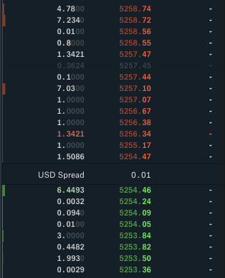
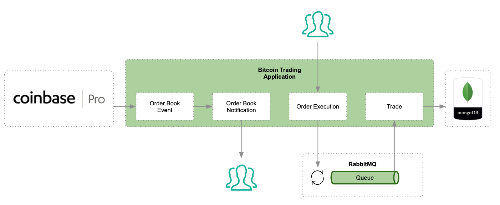

# Bitcoin Trading Application

This is a sample application design to showcase how reactive can help building business applications.

This workshop covers the following topics:

* Websocket with Reactor APIs
* Choosing the right operators for event processing
* Streaming events over HTTP
* Reactive integration with RabbitMQ and MongoDB.

## What is an Order Book

An order book is a board where buyers and sellers will commit to a buy or sell price. Anyone interested in executing a transaction will sell or buy to the price and quantities available within the order book. The order book will naturally always have a spread between the best selling and buying offers. An individual who buys from the order buy will have the effect of raising the price of the currency as he his removing the best selling offers from the order book. The opposite goes from sellers who execute transactions against buyers.  



## Functional domain



This application listens to crypto currencies exchange rates in real time from [Coinbase Pro](https://pro.coinbase.com/trade). Coinbase offers a [public Websocket stream](https://docs.pro.coinbase.com/?r=1#websocket-feed) that notifies each change on the order books. These notifications are raw data that represent unitary changes made on the order book. The application listen for these events and builds the state of the order book.

## The workshop

The `master` branch contains a skeleton of the application. Some classes will require implementations for tests to pass.

### Step 1 - Order Book Event

This domain reflect all event transmitted by the Coinbase websocket API. It only purpose is to the allow the rest of the application to subscribe to raw events from Coinbase.

#### Test class

* [CoinbaseOrderBookEventServiceTest](src/test/java/dev/daniellavoie/reactor/workshop/coinbase/CoinbaseOrderBookEventServiceTest.java)

#### Classes to implement

* [CoinbaseOrderBookEventService](src/main/java/dev/daniellavoie/reactor/workshop/coinbase/CoinbaseOrderBookEventService.java)
* [CoinbaseWebSocketHandler](src/main/java/dev/daniellavoie/reactor/workshop/coinbase/CoinbaseWebSocketHandler.java)

### Step 2 - Order Book Notification

An Order Book Notification is an event that is triggered everything the Order Book is mutated. A notification will also hold a fully computed Order Book. The asks (selling offers) and bids (buying offers) of the order book are sorted by relevance. Cheapest offers for asks and highest for bids. The `OrderBookNotification` object also contains all the offers that were subject to change.

This domain is responsible to listen for Order Book Events and compute the state of the Order Book on each change. Downstream consumers of this domain will benefits of computed view of the order book.  

#### Tasks

* Implement [OrderBookServiceImpl](src/main/java/dev/daniellavoie/reactor/workshop/order/OrderBookServiceImpl.java).

#### Test class

* [OrderBookServiceImplTest](src/test/java/dev/daniellavoie/reactor/workshop/order/impl/OrderBookServiceImplTest.java)

### Step 3 - Order Book Http Streaming

#### Tasks

* Implement [OrderBookController](src/main/java/dev/daniellavoie/reactor/workshop/order/OrderBookController.java)
* Experiment the `publishOn` operator in [OrderBookControllerTest](src/test/java/dev/daniellavoie/reactor/workshop/order/impl/OrderBookControllerTest.java) and observe which threads processes the notifications.

#### Test class

* [OrderBookControllerTest](src/test/java/dev/daniellavoie/reactor/workshop/order/impl/OrderBookControllerTest.java)

#### Example CURL command

```
$ curl -X GET http://localhost:8080/order-book -H "Content-Type: text/event-stream"
```

### Step 4 - Order Execution handling (Reactor RabbitMQ Integration)

When a user wants to instruct the system to execute a trade, he can query the `/order-execution` endpoint

#### Web Service Request Body

[OrderExecution](src/main/java/dev/daniellavoie/reactor/workshop/model/OrderExecution.java)

```
{
  "price": "1000",
  "amount": "1",
  "side"; "buy"
}
```

#### Example CURL command

```
$ curl -X POST http://localhost:8080/order-execution -d '{"price": "1000", "amount": "1", "side"; "buy"}'
```

#### Tasks

* Add a reactive request mapping to [OrderExecutionController](src/main/java/dev/daniellavoie/reactor/workshop/order/OrderExecutionController.java)
* Implement [OrderExecutionServiceImpl](src/main/java/dev/daniellavoie/reactor/workshop/order/OrderExecutionServiceImpl.java) to generate a RabbitMQ message on the `order-execution.exchange` exchange.

#### Test class

* [OrderExecutionControllerTest](src/test/java/dev/daniellavoie/reactor/workshop/order/OrderExecutionControllerTest.java)

### Step 5 - Trade handling (Spring Data with Reactive Mongo)

The last bit of this workshop aims to integrate with Mongo with the Reactive bit of Spring Data.

#### Tasks

* Extend the [TradeRepository](src/main/java/dev/daniellavoie/reactor/workshop/trade/TradeRepository.java) interface with `ReactiveMongoRepository` for the [Trade](src/main/java/dev/daniellavoie/reactor/workshop/model/Trade.java) document.
* Implement [TradeServiceImpl](src/main/java/dev/daniellavoie/reactor/workshop/trade/TradeServiceImpl.java) to subscribe the `order-execution.queue` queue from RabbitMQ and persist a resulting [Trade](src/main/java/dev/daniellavoie/reactor/workshop/model/Trade.java) document in MongoDB using [TradeRepository](src/main/java/dev/daniellavoie/reactor/workshop/trade/TradeRepository.java).

#### Test class

* [TradeServiceImplTest](src/test/java/dev/daniellavoie/reactor/workshop/trade/TradeServiceImplTest.java)

