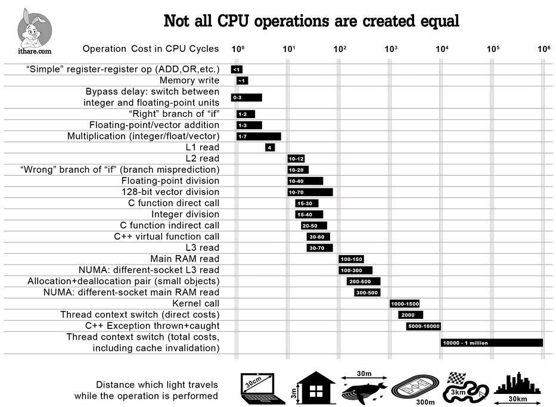

# Reactor Workshop

## A bit of theory

### Concurrency in Java

* OS are fundamentally asynchronous
* The JDK is mostly synchronous
* Java 8 Concurrency API improvement a step in the right direction, but...

### Why Reactive ?

* Blocking processing scales by implementing thread pool that are properly sized
* The right size of a thread pool is determined by a LOT of variables and requires constant attention.
* A single thread pool that is is not big enough to handle the concurrent load will represent a bottleneck for the rest of the processing.
* CPU context switching is expensive.
* The more threads you are running, the more your CPU will switch.

### The Truth about Reactive

Reactive enables you to declare all your processing instructions that are fundamentally non blocking and can be executed by a single thread that will never block. Hence limiting the CPU context switching caused by blocking operations.

Theoretically, Reactive programming increases the number of instructions processed by the CPU. However, it improves the flow of instruction that are sent to the CPU as less context switching is to occur. In the end, you are moving your performance bottleneck to the OS and away from poorly sized thread pools defined in your application.

### Uses cases for Reactive

* Event driven processing
* Chaining calls across distributed services

### The Reactive ecosystem

* Project Reactor from Pivotal
* .Net Reactive Extensions from Microsoft
* RxJava from Netflix
* VertX from Redhat
* Akka Streams from Lightbend

## Workshops

#### Concurrency in Java

Source code available in `01-async-java`

* Acknowledged native construct of the JDK for non blocking processing.
* Review the concepts of declarative programming and sceduling

#### Lite RX API Hands On

Source code available in the git submodule `02-lite-rx-api-hands-on`

* Reviews the concept of publishers and subscribers.
* Understand the core operators of Project Reactor.

#### Reactor concepts

* Nothing happens until you subscribe
* Backpressure
* [Which Operators?](https://projectreactor.io/docs/core/release/reference/index.html#which-operator)
* Understanding Marbles Diagrams

#### Bitcoin Trading application

Source code available in `03-bitcoin-trading`.

Showcases usage for reactive programming in the context of a Spring Boot Application.
  
* Reactive Web Socket processing
* Transform raw events to business events with reactive operators.
* Showcase how Spring enables Non Blocking IOs with external services such as MongoDB and RabbitMQ.

#### Advanced topics and extras

* Schedulers (playing with the threading model)
* Hot vs Cold publishers (and processors)
* Reative Spring Cloud
* [Error handling (and exponential backoff)](https://projectreactor.io/docs/core/release/reference/index.html#faq.exponentialBackoff) 
* Wrapping blocking operations
* Tuples